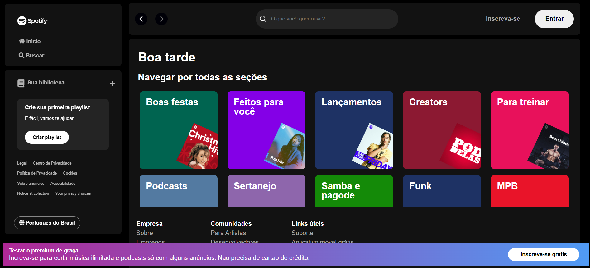
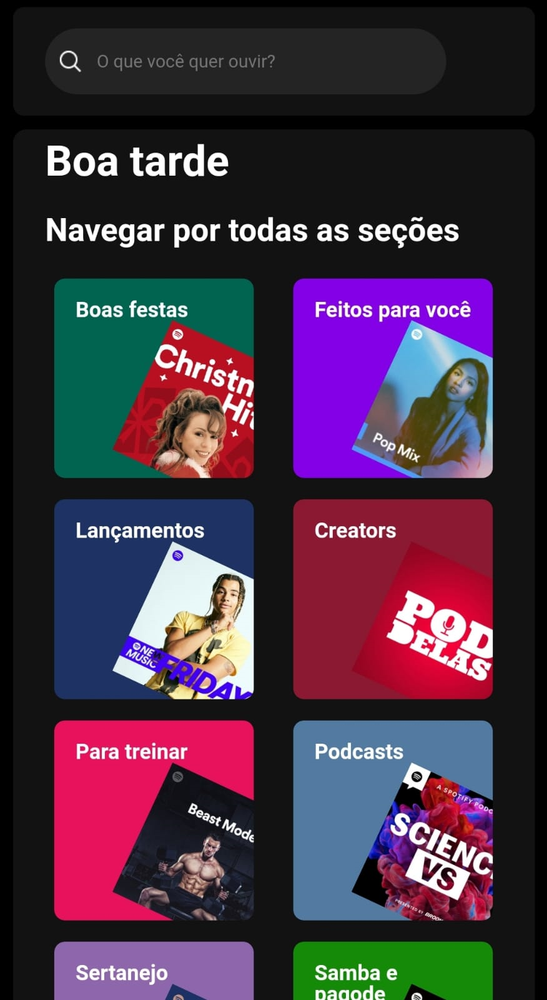

## Clone do Spotify
Este projeto foi criado para praticar meus conhecimentos de HTML, CSS e JavaScript, e foi construido na Imersão Front-End da Alura. Ele inclui a página inicial do Spotify para desktop e responsividade para mobile.

## Tecnologias utilizadas
- HTML
- CSS
- JavaScript
